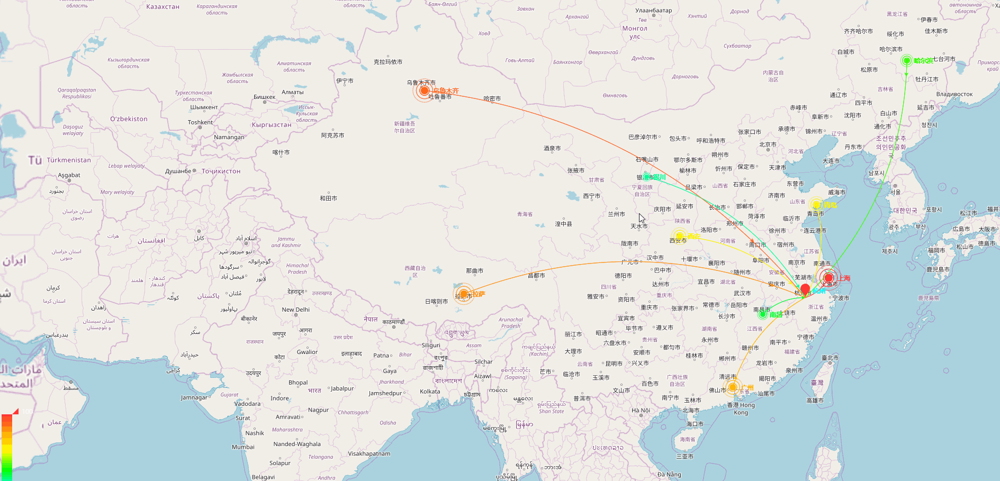

# openlayers_echart
**最新版的OpenLayers与最新的ECharts相结合，实现了将ECharts中的地图换成OpenLayers的地图。**

---


---

- **npm使用**
1. 通过npm安装
```
npm install openlayers_echart
```
2. 项目中引用

```
import ADLayer from 'openlayers_echart'

var oe = new ADLayer(option,map,echarts) 
oe.render()
```

- **ES6使用方法**：
1. 下载项目目录中js文件：*openlayers_echart/src/openlayers.echart.js*
2. 在自己的js文件中添加：
```
import ADLayer from '(openlayers.echart.js文件所在路径，相对绝对均可）'
```
3. 实例化。（option为ECharts中的配置项，map为OL的地图对象，echarts为ECharts的共有输出对象（不是自己初始化的那个））
```
var oe = new ADLayer(option,map,echarts) 
oe.render()
```

---
- **ES5使用方法：**
1. 下载项目目录中js文件:*openlayers_echart/dist/JS/openlayers_echart.es5.js*
2. 在html页面中引入该js文件，该文件依赖Echart库的js的文件。
3. 实例化。（option为ECharts中的配置项，map为OL的地图对象，echarts为ECharts的共有输出对象（不是自己初始化的那个））
```
var oe = new ADLayer(option,map,echarts) 
oe.render()
```


